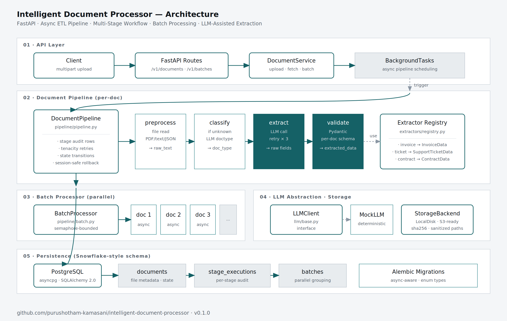
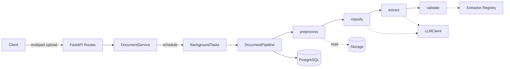

# Intelligent Document Processor

> End-to-end document ingestion pipeline with LLM-assisted extraction, multi-stage workflow orchestration, schema validation, and parallel batch processing — built on FastAPI, async SQLAlchemy, and PostgreSQL.

[](https://github.com/purushotham-kamasani/intelligent-document-processor/actions/workflows/ci.yml)


---

## What this is

A backend service that turns semi-structured documents (invoices, support tickets, contracts, plus PDFs and JSON payloads) into validated, application-ready records. The pipeline runs every uploaded document through a sequence of stages — **preprocess → classify → extract → validate** — and persists a full audit trail of each stage's outcome, retries, and errors.

This repo demonstrates patterns I think matter for shipping document AI in production:

- **State machines over status fields** — every transition is explicit and persisted
- **Per-doc-type extraction schemas** — invoices, tickets, and contracts have their own Pydantic shapes
- **Auto-classification fallback** — if you don't know the doc type, the LLM picks one
- **Bounded-concurrency batch processing** — submit N documents, get them processed in parallel with a configurable limit
- **Session-safe failure handling** — when a stage fails mid-transaction, we rollback and persist the failure cleanly instead of poisoning the session

## Architecture





## Quick start

```bash
git clone https://github.com/purushotham-kamasani/intelligent-document-processor.git
cd intelligent-document-processor
cp .env.example .env
docker compose up --build
```

The API runs on **port 8001** (Project 1 uses 8000), Postgres on **5433** — so both can run side by side.

```bash
# Upload an invoice — the pipeline kicks off automatically.
curl -X POST http://localhost:8001/v1/documents \
  -F 'file=@example_invoice.txt;type=text/plain' \
  -F 'doc_type=invoice'

# Returns: {"id": "...", "filename": "...", "status": "uploaded", "doc_type": "invoice"}

# Poll for the result.
curl http://localhost:8001/v1/documents/<id>

# Submit a batch.
curl -X POST http://localhost:8001/v1/batches \
  -H 'Content-Type: application/json' \
  -d '{"document_ids": ["uuid-1", "uuid-2", "uuid-3"]}'

# Interactive API docs.
open http://localhost:8001/docs
```

## Local development

```bash
make install   # creates .venv, installs deps
make migrate   # apply Alembic migrations
make dev       # uvicorn with --reload
make test      # 41 tests, 83% coverage
make lint      # ruff check
make format    # ruff format + autofix
```

## Project layout

```
app/
├── api/v1/             # FastAPI routes (documents, batches)
├── core/               # config, logging, exceptions
├── db/                 # async SQLAlchemy session
├── extractors/         # registry mapping doc types → schemas + prompts
├── llm/                # LLMClient interface + mock implementation
├── models/             # ORM models (Document, StageExecution, Batch)
├── pipeline/           # DocumentPipeline + BatchProcessor + preprocessor
├── schemas/            # Pydantic API contracts + doc-type shapes
└── services/           # DocumentService + storage abstraction
alembic/                # Database migrations
tests/                  # 41 tests across unit + integration
docs/diagrams/          # Architecture diagrams (SVG + PNG)
```

## Document state machine

```
uploaded → preprocessing → extracting → validating → ready
                                           ↓
                                        failed
```

Each transition is recorded; the document's current state is queryable at any moment via `GET /v1/documents/{id}`.

## Supported document types

| Type | Schema | What it extracts |
|---|---|---|
| `invoice` | `InvoiceData` | invoice_number, dates, vendor, customer, line_items, subtotal, tax, total |
| `support_ticket` | `SupportTicketData` | customer, category, priority, summary, sentiment |
| `contract` | `ContractData` | title, parties, dates, term, governing_law, key_obligations |
| `unknown` | (auto-classified) | LLM picks the most likely type, then extracts accordingly |

Adding a new doc type:

1. Define its Pydantic schema in `app/schemas/document.py`
2. Add an extraction prompt and `ExtractorSpec` to `app/extractors/registry.py`
3. (For the mock LLM) add a routing case in `app/llm/mock.py:_route`

That's it — the pipeline, API, and persistence all work without further changes.

## Supported file types

| Mime type | How it's parsed |
|---|---|
| `text/plain` | UTF-8 decode |
| `text/markdown` | UTF-8 decode |
| `application/pdf` | `pypdf` text extraction |
| `application/json` | Flattened to key.path: value lines |

Adding new types (`.docx`, `.html`, OCR for image PDFs) means adding a branch in `app/pipeline/preprocessor.py:extract_text`.

## API

| Method | Endpoint | Purpose |
|---|---|---|
| `POST` | `/v1/documents` | Upload a document (multipart). Auto-processes by default. |
| `GET` | `/v1/documents/{id}` | Fetch a document with all stage executions. |
| `GET` | `/v1/documents` | List documents (newest first, paginated). |
| `POST` | `/v1/documents/{id}/process` | Manually trigger processing for an uploaded doc. |
| `GET` | `/v1/documents/types` | List supported doc types. |
| `POST` | `/v1/batches` | Submit a batch of documents for parallel processing. |
| `GET` | `/v1/batches/{id}` | Fetch batch status (pending/running/completed/partial/failed). |
| `GET` | `/health` | Liveness probe. |
| `GET` | `/docs` | Interactive Swagger UI. |

## Design decisions

### 1. Why a Snowflake-style schema instead of a JSON blob per document?

Three separate tables (`documents`, `stage_executions`, `batches`) make analytics queries straightforward: average pipeline latency by doc type, failure rate per stage, batch throughput over time. A single fat JSON column would be opaque to BI tools. The relational shape pays off the first time you need a dashboard.

### 2. Why per-doc-type schemas instead of a generic extraction shape?

LLMs are remarkably better at extraction when you give them an exact target structure. Plus, downstream consumers want typed records — `invoice.line_items[0].total` is more useful than `extracted_data["maybe_a_total"]`. The cost is one Pydantic model per doc type, which is trivial.

### 3. Why bounded concurrency for batches instead of unbounded asyncio.gather?

Real LLM APIs rate-limit. Unbounded concurrency wins the demo and loses production. `asyncio.Semaphore(N)` caps in-flight calls without queueing infrastructure — it's the right tool when "N" is a small constant (4-10) and we don't need cross-process scaling. The event-driven sibling repo handles that case with Redis workers.

### 4. Why rollback-then-update in failure paths?

When a stage raises mid-transaction, the session is in a poisoned state — subsequent commits silently fail to find rows that "should" be there. The fix is explicit: rollback first, then re-fetch the row and update it on a clean session. This shows up everywhere in production code and is the kind of subtle bug that bites you the first time concurrency enters the picture. The integration test `test_batch_marks_partial_when_some_fail` exercises this path.

## Reliability mechanics

| Concern | How it's handled |
|---|---|
| Malformed LLM JSON | Treated as `LLMTransientError`; retried with exponential backoff |
| Missing storage file | Stage rolls back the audit row, persists `failed` status cleanly |
| Schema violation | `ValidationError` with per-field error list, returned as HTTP 422 |
| Unsupported mime type | Rejected at upload time with HTTP 415 |
| Oversized upload | Capped via `MAX_UPLOAD_BYTES`, rejected with HTTP 413 |
| Empty file | Rejected with HTTP 413 |
| Re-processing a `ready` document | HTTP 409 with explanation |
| Audit trail | Every stage logs attempts, errors, timestamps, and output summary |

## Testing strategy

```
tests/
├── unit/                       # 17 tests, no DB
│   ├── test_mock_llm.py        # routing, JSON shapes, flake behavior
│   ├── test_preprocessor.py    # text / PDF / JSON parsing
│   ├── test_storage.py         # save/read/delete/sha256
│   └── test_registry.py
└── integration/                # 24 tests, in-memory SQLite + ASGI
    ├── test_pipeline.py        # end-to-end per doc type, retry path
    ├── test_api.py             # upload → poll, error responses
    └── test_batch.py           # parallel processing, partial failures
```

Integration tests use SQLite with `StaticPool` so background tasks share the schema with the test that created it — a real gotcha. The mock LLM uses a fixed RNG seed so even the "flaky" tests are reproducible.

## What I'd do next

- **Webhook callbacks** — let clients subscribe to document `ready`/`failed` instead of polling
- **S3 storage backend** — the `StorageBackend` interface is already set up; just need to implement
- **Idempotent upload via SHA256** — return the existing document if you upload the same bytes twice
- **OCR for image PDFs** — `pypdf` only handles text PDFs; scanned invoices need `tesseract` or similar
- **Confidence thresholds** — when classification confidence is < 0.7, route to a human-review queue
- **OpenTelemetry traces** — span-per-stage would surface slow pipelines in Jaeger

## License

MIT — see [LICENSE](LICENSE).

---

Part of a four-repo portfolio demonstrating production-grade patterns for LLM-integrated backend systems. Companion repos: [agentic-workflow-system](https://github.com/purushotham-kamasani/agentic-workflow-system) (orchestration), event-driven processing, and a full-stack GenAI app.
